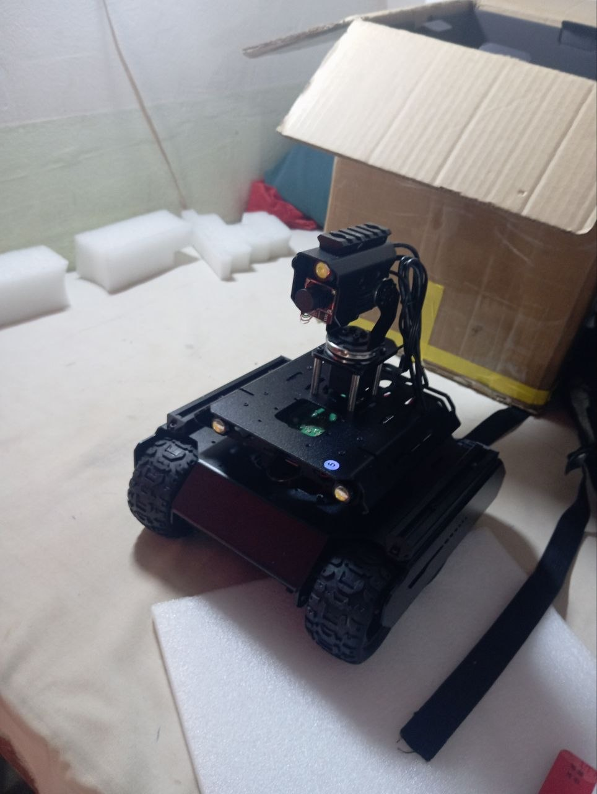
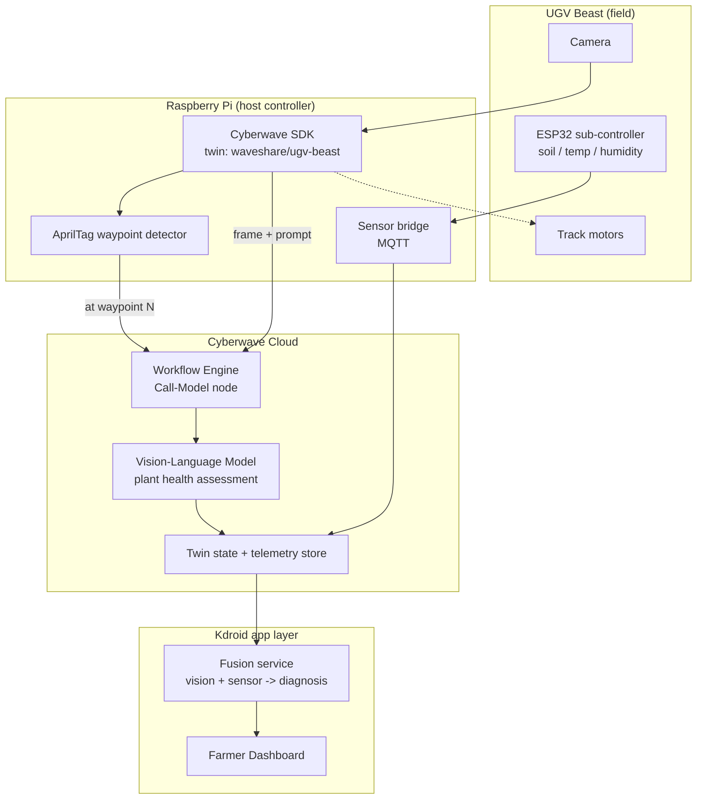

# Kdroid

Autonomous plant-scouting on a Waveshare UGV Beast, built on the Cyberwave SDK.

Kdroid drives a tracked field robot between marked crop positions, captures an
image at each stop, sends it through a Cyberwave AI workflow for a health
assessment, fuses that with local soil/environment sensor readings, and pushes
a farmer-readable summary to a dashboard. Built for the Cyberwave Builders
Program.

## Why this project

Smallholder farmers rarely have time to walk every row and inspect every
plant. Kdroid does the walking and the looking, and turns "plant 7 in row 3
looks stressed" into something a farmer can act on without needing to
interpret a raw model output.

## Status

🚧 Early build — Builders Program cohort. See [`docs/ROADMAP.md`](docs/ROADMAP.md)
for what's done and what's next.

## Architecture



**Loop, in words:**

1. Robot moves along a row using Cyberwave move primitives (`move_forward`,
   `turn_left`, etc.) driven by `src/kdroid/robot_control.py`.
2. `waypoint_manager.py` watches the camera feed for AprilTags staked at each
   plant/row position. No SLAM — deterministic, drift-free position IDs.
3. On arrival, `workflow_trigger.py` uploads the current frame and fires a
   Cyberwave workflow that calls a VLM with a plant-health prompt.
4. In parallel, `sensor_bridge.py` relays ESP32 soil/temperature/humidity
   readings into Cyberwave over MQTT.
5. A fusion step combines the VLM's read with the sensor readings (e.g.
   wilting + dry soil vs. wilting + saturated soil mean different things) and
   writes a plain-language record.
6. The dashboard (`dashboard/`) shows per-row, per-plant status over time.

See [`ARCHITECTURE.md`](ARCHITECTURE.md) for the full breakdown and open
design questions, and [`docs/reference-projects.md`](docs/reference-projects.md)
for prior art this design borrows from.

## Repo layout

```
Kdroid/
├── src/kdroid/           # core Python package
│   ├── robot_control.py     # Cyberwave twin pairing + movement
│   ├── waypoint_manager.py  # AprilTag detection + proximity trigger
│   ├── workflow_trigger.py  # image upload + Cyberwave workflow call
│   ├── sensor_bridge.py     # ESP32 -> MQTT -> Cyberwave telemetry
│   └── config.py            # env / constants
├── scripts/
│   └── run_scout_loop.py    # top-level orchestrator, phase 1 entrypoint
├── workflows/
│   └── plant_health_workflow.md  # Cyberwave Studio workflow spec
├── dashboard/             # farmer-facing dashboard (phase 4)
├── docs/
│   ├── ROADMAP.md
│   └── reference-projects.md
├── requirements.txt
└── .env.example
```

## Quickstart

```bash
git clone <this-repo>
cd Kdroid
python -m venv .venv && source .venv/bin/activate
pip install -r requirements.txt
cp .env.example .env   # fill in CYBERWAVE_API_KEY, twin UUID, etc.

# 1. Pair the robot (run on the Raspberry Pi over SSH, once)
cyberwave pair

# 2. Sanity check in simulation before touching hardware
python scripts/run_scout_loop.py --sim

# 3. Run for real
python scripts/run_scout_loop.py
```

See [`docs/ROADMAP.md`](docs/ROADMAP.md) for the phased build order — start
there, not with the whole pipeline at once.

## License

MIT — see [`LICENSE`](LICENSE).
